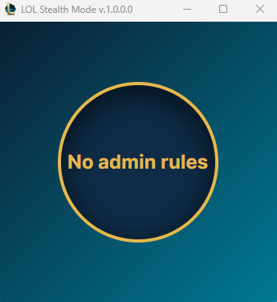
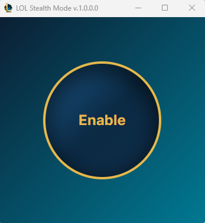
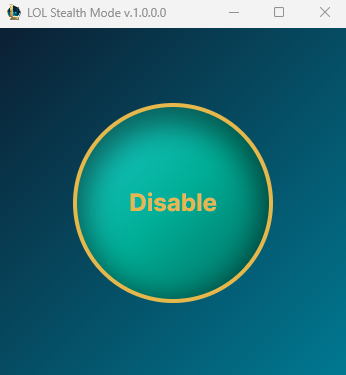

# LOL Stealth Mode
## Usage
1) Run the "LolStealthMode.Desktop.exe" file with administrator privileges. The application will not be able to configure the firewall without administrator privileges.

2) Click the "Enable" button to switch to Stealth mode.

3) The application can be closed; the firewall changes have already been saved. Click the "Disable" button to exit Stealth mode.

